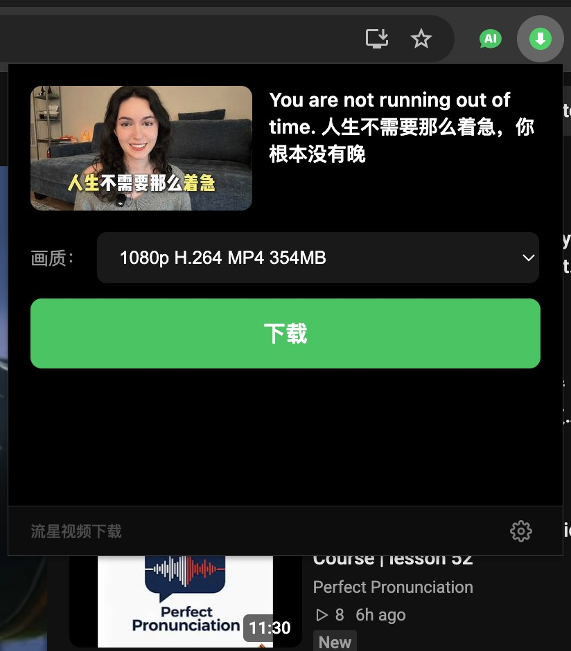
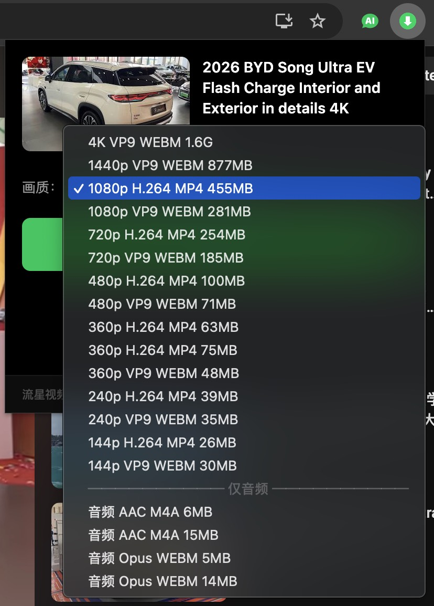
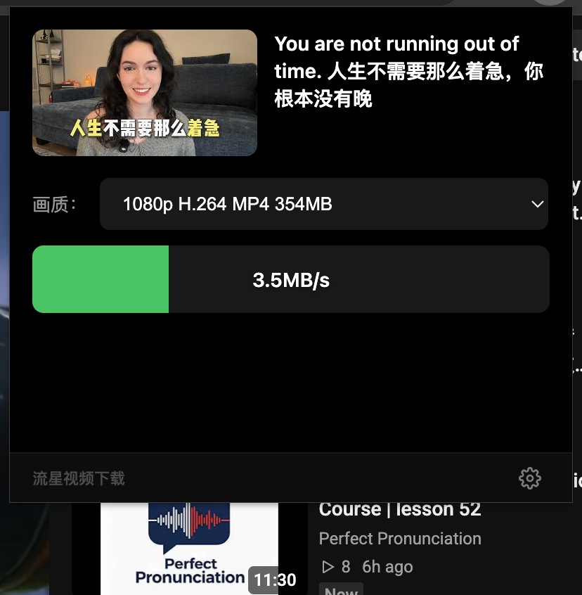

<p align="right">
  <a href="README.md">中文</a>
</p>

# Shooting Star Downloader

A browser extension to download YouTube videos with one click. All processing is done locally.

> Supports Chromium-based browsers such as Microsoft Edge, Google Chrome, and 360 Browser, on both Windows and macOS.

## Features

- Open any YouTube video page, click the extension icon, choose a quality, and download
- Supports multiple resolutions including 4K, 1080P, 720P, and audio-only downloads
- Automatically merges video and audio streams into a complete MP4 file
- Real-time download progress with pause and resume support
- Play the downloaded video or open its folder directly from the extension
- Chinese and English UI switching

## Screenshots





## How it works

```
YouTube Page → Extension extracts video info → Native Messaging → Local Python script → yt-dlp download + FFmpeg merge → Save to local disk
```

1. The extension extracts the video title and available formats from the YouTube page
2. After the user selects a quality, the extension sends the download command to the local `stardownload.py` script via Chrome Native Messaging
3. `stardownload.py` invokes yt-dlp to download the video and audio streams
4. After downloading, it invokes FFmpeg to merge them into a complete video
5. The video is saved to the `~/Downloads` directory

Everything runs locally — no user data is ever uploaded.

## Installation

### Install from Store (Recommended)

[](https://microsoftedge.microsoft.com/addons/detail/%E6%B5%81%E6%98%9F%E8%A7%86%E9%A2%91%E4%B8%8B%E8%BD%BD/jflocelmhojnkfdiohkoaeepedilngjc)

> On first launch, an installation guide will appear automatically, providing two setup files and a terminal command for one-click installation of yt-dlp and FFmpeg.

### Load as Unpacked Extension

1. Clone this repository
2. Open your Chromium browser and go to `chrome://extensions/`
3. Enable "Developer mode"
4. Click "Load unpacked" and select the project directory

## Project Structure

```
├── manifest.json           # Extension configuration
├── background.js           # Service Worker
├── content/
│   └── content.js          # YouTube page content script
├── popup/
│   ├── popup.html          # Popup window
│   ├── popup.js            # Popup logic
│   ├── popup.css           # Popup styles
│   └── i18n.js             # i18n module
├── locales/                # Translation files
│   ├── en.json
│   └── zh_CN.json
├── _locales/               # Chrome Web Store translations
│   ├── en/messages.json
│   └── zh_CN/messages.json
├── native/
│   └── stardownload.py     # Native Messaging Host (Python)
├── icons/                  # Extension icons
├── install.sh              # macOS installer
└── install.ps1             # Windows installer
```

## Credits

Built on top of these open-source projects:

- [yt-dlp](https://github.com/yt-dlp/yt-dlp) — Video parsing and download engine
- [FFmpeg](https://ffmpeg.org) — Audio/video merging and processing

## License

This project is open-sourced under the MIT License. See [LICENSE](LICENSE) for details.
